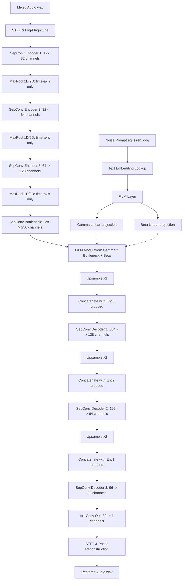

# 🎙️ NeuroVoice: Edge-Native Text-Conditional Audio Restoration

[](https://doi.org/10.1109/ICDCS68853.2026.11510942)
[](https://ieeexplore.ieee.org/document/11510942)
[](https://pytorch.org/)
[](https://developer.android.com/)
[](https://kotlinlang.org/)
[](https://opensource.org/licenses/MIT)

NeuroVoice is an edge-native, text-conditional noise reduction system. Unlike conventional audio enhancement models that act as blind filters, NeuroVoice introduces a semantic control layer via text embeddings. This allows users to specify through natural language prompts exactly which noise classes to suppress (e.g., "siren", "dog barking") while leaving desired background sounds intact. 

The core model is optimized for real-world deployment on resource-constrained edge devices (such as Android smartphones) using **Depthwise Separable Convolutions** and **Post-Training Integer Quantization**.

---

## 📄 Research Publication

This work has been presented and published at the **2026 8th International Conference on Devices, Circuits, and Systems (ICDCS)**.

*   **Title**: *Edge-Native Text-Conditional Noise Reduction: A Multimodal Approach via FiLM-Modulated U-Nets*
*   **DOI**: [10.1109/ICDCS68853.2026.11510942](https://doi.org/10.1109/ICDCS68853.2026.11510942)
*   **IEEE Xplore Link**: [Read Paper on IEEE Xplore](https://ieeexplore.ieee.org/document/11510942)
*   **Authors**: Kishore N S, M Chandralekha, Sanjjey A, Rahul Raj M
*   **Affiliation**: Department of Computer Science and Engineering, Amrita School of Computing, Amrita Vishwa Vidyapeetham, Chennai, India.

### 📝 Abstract
> Conventional audio enhancement systems usually function as blind filters that indiscriminately filter out all background noise based on the statistical spectral deviations. Though this method is generally effective in most situations, it is devoid of user control and does not consider the context; it cannot tell the difference between an undesired sound (for example, a siren or a construction drill) and an acceptable background noise (for example, pleasant ambient music or a necessary alert). In response, the authors are presenting a new system called Edge-Native Text-Conditional audio Restoration where a control layer based on meaning is introduced in the process of denoising hence allowing users through natural language prompts to indicate precisely the noise source that is to be suppressed. The suggested approach brings together CV methods alongside NLP by employing a U-Net architecture augmented with FiLM (Feature-wise Linear Modulation) layers. These layers provide the means to change the feature maps of the network depending on the text embeddings which in fact, dresses the model to make it capable of spectrally subtracting certain sound classes while allowing the others to remain intact. Moreover, to make the system suitable for real-world use on resource-limited edge devices, the model adopts the method of Depthwise Separable Convolutions and post-training integer quantization which further brings about drastic reduction in the computational complexity. The system is developed on a "Synthetic Data Factory" dataset consisting of dynamically created triplets of clean audio, noise, and mixed audio, thus guaranteeing robustness in varying Signal-to-Distortion Ratio (SDR). The experimental findings reveal that the suggested lightweight model reaches a comparable PERceptual Evaluation of audio Quality (PESQ) score to bigger baseline.

### 🏷️ BibTeX Citation
```bibtex
@INPROCEEDINGS{11510942,
  author={N S, Kishore and Chandralekha, M and A, Sanjjey and M, Rahul Raj},
  booktitle={2026 8th International Conference on Devices, Circuits, and Systems (ICDCS)}, 
  title={Edge-Native Text-Conditional Noise Reduction: A Multimodal Approach via FiLM-Modulated U-Nets}, 
  year={2026},
  pages={1-6},
  doi={10.1109/ICDCS68853.2026.11510942}}
```

---

## ⚙️ Architecture

The system uses a multimodal approach combining digital signal processing (STFT/ISTFT), computer vision (U-Net feature extraction), and natural language processing (text embeddings). Text conditioning is dynamically fused with deep audio features via **FiLM (Feature-wise Linear Modulation)** layers.



### Key Technical Blocks:
*   **SepConv (Depthwise Separable Convolutions)**: Substantially reduces parametric complexity and compute cost, making U-Net real-time on edge devices.
*   **FiLM Modulation**: Fuses text conditioning directly inside the network bottleneck:
    $$\text{FiLM}(F) = \gamma(T) \cdot F + \beta(T)$$
    where $F$ represents visual audio feature maps and $T$ represents the text embeddings.

---

## 📂 Repository Structure

```
.
├── android_app/             # Complete Android Studio project (Kotlin)
│   └── app/
│       └── src/main/
│           ├── assets/      # Bundled PyTorch Mobile model weights
│           ├── java/        # MainActivity.kt (PCM decoding, tensor inference, WAV encoding)
│           └── res/         # Premium XML layouts (Glassmorphism design, Preset chips)
├── mobile_utils/            # Script tracing, wrapper, and PyTorch Mobile export utilities
│   ├── convert_to_mobile.py # Trace & export model script
│   ├── export_wrapper.py    # Bundles STFT -> Inference -> ISTFT into a single JIT trace
│   └── *.ptl, *.pt          # Exported Mobile weights
├── tests/                   # Pytest test cases for dataset, model, and preprocessing
├── dataset.py               # PyTorch Audio Dataset with on-the-fly SNR mixing
├── model.py                 # Core network architecture (SepConv, FiLM, TextEncoder, NanoUNetFiLM)
├── preprocess.py            # STFT, ISTFT, Log-Magnitude, Mag/Phase extraction utilities
├── train.py                 # Neural network training loop with L1 Loss
├── infer.py                 # Local Python CLI script for restoration inference
├── quantize.py              # Dynamic quantization (FP32 -> INT8)
└── requirements.txt         # Python dependencies
```

---

## 🚀 Getting Started

### 🐍 Python Backend (Training & Local Inference)

1.  **Clone the Repository**:
    ```bash
    git clone https://github.com/Kishorens17/Neurovoice-Application-for-adaptive-audio-noice-cancellation.git
    cd Neurovoice-Application-for-adaptive-audio-noice-cancellation
    ```

2.  **Install Dependencies**:
    ```bash
    pip install -r requirements.txt
    ```

3.  **Generate Dummy Dataset (Quick Start)**:
    If you don't have LibriSpeech and ESC-50 datasets downloaded, you can generate synthetic audio data for testing:
    ```bash
    python generate_dummy_data.py
    ```

4.  **Train the Model**:
    ```bash
    python train.py
    ```
    This trains the `NanoUNetFiLM` architecture and saves `nano_unet_film.pth` and `text_encoder.pth`.

5.  **Run Inference**:
    Ensure you have a sample `noisy.wav` in the directory, then run:
    ```bash
    python infer.py
    ```
    Enter the target noise category to suppress (e.g. `siren`, `dog`, `keyboard`) when prompted.

6.  **Quantize Model (Dynamic INT8)**:
    ```bash
    python quantize.py
    ```

---

## 📱 Mobile Deployment (Android App)

The repository includes a complete Android Studio project containing a premium UI crafted with Glassmorphic styles and custom preset chips.

### Model Export Flow
The Android app utilizes PyTorch Mobile to perform inference directly on the device. Instead of writing custom complex C++ DSP routines for STFT and ISTFT in Android, the entire pre- and post-processing pipeline is written in PyTorch and traced together into a single PyTorch JIT graph:

```bash
cd mobile_utils
python export_wrapper.py
```
This script traces `MobileAudioWrapper` (which handles audio inputs, computes STFT, runs the neural net, and runs ISTFT) and saves the serialized bundle directly into the Android assets directory (`android_app/app/src/main/assets/audio_enhancer_mobile.pt`).

### Android Pipeline
1.  **Audio Decoding**: Decodes standard compressed audio formats (mp3, m4a, wav, etc.) to a floating-point PCM array using Android's `MediaExtractor` and `MediaCodec`.
2.  **Model Run**: Feeds the decoded audio array and the text token ID to the PyTorch Mobile module.
3.  **Audio Encoding**: Packages the output floats back into a standard 16-bit PCM WAV file with a valid 44-byte RIFF header so it can be exported or played immediately via `AudioTrack`.
